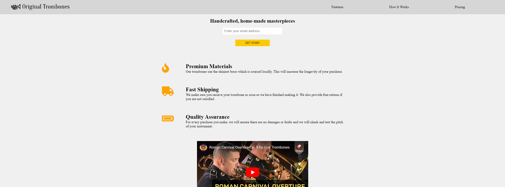

# FreeCodeCamp Course: Responsive Web Design 

<h1 align="center"> </h1>

**About this Project:**

this project is the creation of a landing page website. 

This site was created to be responsive, the main challenge was to make the video that came from you tube responsive.
Another challenge was the assembly of a responsive header given the obligation to keep it fixed at the top of the screen

**Technologies**

- HTML
- CSS

**Course Link:**

https://www.freecodecamp.org/learn/2022/responsive-web-design/